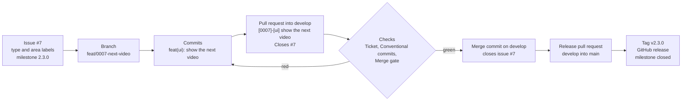

# Contributing to Momentum

Thanks for helping make Momentum better. Bug reports, ideas and pull requests are all welcome.

## Getting set up

1. Install Xcode 16 or later (Xcode 26+ to see the Liquid Glass design).
2. Clone the repository and create your signing override:
   ```bash
   cp Config/Local.xcconfig.example Config/Local.xcconfig
   ```
   Set `DEVELOPMENT_TEAM` to your team ID (Xcode → Settings → Accounts; a free Apple ID works) and
   `BUNDLE_ID_PREFIX` to something you own, such as `com.yourname`.
3. Open `Momentum.xcodeproj` and run the **Momentum** scheme, or run `./scripts/install.sh`.
4. Have git check each commit message as you write it:
   ```bash
   ./scripts/install-hooks.sh
   ```

## Issues first

Everything that changes starts as an issue, whatever its size: a feature, a bug, an enhancement or
a chore. The issue says what and why, and the pull request that closes it says how. From an issue
you can follow the work to its branch, its pull request, the merge into `develop` and the release
that shipped it.



### Opening an issue

Pick a form: **Feature** for something new, **Enhancement** for an improvement to something that
exists, **Bug** for something broken, and **Task** for upkeep nobody sees, such as a refactor, CI
or tooling. Blank issues are turned off. Title the issue with what to do, plainly and without a
prefix, such as `Show the next video beside the ring`; the labels carry the rest.

Each form applies its type label and `status: needs triage`, asks which areas the issue touches,
and asks for acceptance criteria. The **Issue area** workflow then adds the areas as labels. From
the command line, an issue gets its labels and milestone directly:

```bash
gh issue create --title "Show the next video beside the ring" --body-file issue.md \
  --label "type: feature" --label "area: ui" --milestone 2.3.0
```

### Labels

`.github/labels.yml` defines every label, and the **Labels** workflow applies it to GitHub when it
changes on `develop`; `./scripts/sync-labels.sh --dry-run` shows what that would change. Edit a
label in the file, not on GitHub.

Every issue has one type label:

| Type | For |
|------|-----|
| `type: feature` | Something new people can see or do |
| `type: bug` | Something doesn't work the way it should |
| `type: enhancement` | An improvement to something Momentum already does |
| `type: docs` | Documentation only |
| `type: task` | Chores, refactors, CI and tooling: nothing people see changes |
| `type: release` | A version: the bump, changelog, release pull request, tag and notes |

And at least one area label, which tells the screens apart from the engine underneath:

| Area | Covers |
|------|--------|
| `area: ui` | SwiftUI screens and components in `SharedUI/`, `Momentum/` and `MomentumMobile/` |
| `area: core` | The backend: MomentumCore's models, engine and persistence in `Packages/MomentumKit` |
| `area: sync` | Sync between devices: the sync folder, merges and save stamps |
| `area: watch` | The watch app and its complications |
| `area: widgets` | Widgets, controls and the Live Activity |
| `area: mac` | The Mac app alone: its windows, menus and menu bar |
| `area: ios` | The iPhone and iPad app alone |
| `area: import` | Importing and exporting: backups, books, goals and to-dos from videos |
| `area: ci` | GitHub workflows and checks, in `.github` |
| `area: docs` | The README, this guide, `docs/` and the changelog |
| `area: tooling` | Scripts, git hooks, project skills and other developer tools |
| `area: release` | Versions, release pull requests, tags, notes and the App Store |

`priority: high`, `priority: medium` and `priority: low` say how soon, once that matters.
`status: needs triage` marks a new issue, and `status: blocked` one that waits on something the
issue names. Dependabot's `dependencies` and `github_actions` stay, and so do GitHub's usual
labels, such as `good first issue` and `duplicate`.

### Triage

Each new issue is looked at once: it has one type, the right areas, acceptance criteria someone can
check, and the upcoming milestone. Then `status: needs triage` comes off.

### Work across areas

An issue that spans several areas is split, so that each pull request stays in one area. The issue
becomes the parent, with one
[sub-issue](https://docs.github.com/en/issues/tracking-your-work-with-issues/using-issues/adding-sub-issues)
per area, and each pull request closes one sub-issue. Close the parent with its last sub-issue.

```text
#20  Show the next video beside the ring        type: feature
├── #21  Store the next video's length          area: core   [0021]-[core] store the next video's length
└── #22  Show the next video beside the ring    area: ui     [0022]-[ui] show the next video beside the ring
```

### Milestones

Every version has a milestone named after it, and `2.3.0` is the next one. Triage puts each issue
in the upcoming milestone, so the milestone shows what's left before the release. Releasing closes
it, and anything unfinished moves to the next one.

### The board

The [Momentum project](https://github.com/users/Leeevai/projects/1) follows every issue: **Todo**
once it's triaged, **In progress** while its branch exists, **In review** while its pull request is
open, and **Done** once it merges.

## Branches

`develop` is the default branch, where changes come together, and `main` holds what has been
released. Nobody pushes to either one: every change is a branch and a pull request into `develop`,
and `main` only takes release pull requests from `develop`, and hotfixes.

Name a branch `<type>/<NNNN>-<description>`: one of the commit types below, the issue's number
padded to four digits, then a few words in lowercase kebab-case.

```text
feat/0007-next-video
fix/0012-streak-after-midnight
docs/0015-watch-simulators
chore/0020-release-2.3.0
```

## Commits

Every commit follows [Conventional Commits 1.0](https://www.conventionalcommits.org/en/v1.0.0/):

```text
<type>(<scope>)!: <subject>

<body>

<footers>
```

- The **type** is required: one from the table below.
- The **scope** is optional: the part of the project, in lowercase kebab-case.
- **`!`** marks a breaking change, such as a data format older versions can't read. A
  `BREAKING CHANGE: <what breaks>` footer does too, and says more.
- The **subject** says what the commit does, in the imperative ("add", not "added"). It starts with
  a lowercase letter and has no period at the end.
- The whole first line is at most 72 characters.
- The **body** is optional. Wrap it at 72 characters and explain why, not how.

| Type | For |
|------|-----|
| `feat` | Something new people can see or do |
| `fix` | A bug fix |
| `perf` | The same behavior, faster or lighter |
| `refactor` | A code change that neither fixes a bug nor adds a feature |
| `style` | Formatting only; the code means the same |
| `test` | Adding or correcting tests |
| `docs` | Documentation only |
| `build` | The Xcode project, the package manifest, build settings and signing |
| `ci` | The GitHub workflows and the checks they run |
| `chore` | Upkeep that changes no app code, such as releases and dependency settings |
| `revert` | Undoing an earlier commit |

Common scopes, though any lowercase kebab-case word works:

| Scope | Covers |
|-------|--------|
| `core` | MomentumCore, in `Packages/MomentumKit` |
| `mac` | The Mac app |
| `ios` | The iPhone and iPad app |
| `watch` | The watch app and its complications |
| `widgets` | The widgets and the Live Activity |
| `ui` | The screens and the design system both apps share, in `SharedUI/` |
| `import` | Importing goals, books and backups |
| `sync` | Sync between devices |
| `scripts` | `scripts/` |
| `ci` | The workflows |
| `deps` | Dependency updates |
| `release` | Versions and release pull requests |
| `readme`, `privacy`, `changelog` | `README.md`, `docs/PRIVACY.md` and `CHANGELOG.md` |

Good:

```text
feat(widgets): add a lock screen widget for the current streak
fix(sync): keep the newer journal entry when two devices edit it
perf(core): compute streaks once a day instead of on every change
docs(readme): explain running the watch app on a simulator
ci: build the iPhone app in its own job
chore(release): v2.3.0
feat(core)!: store focus sessions in their own file
```

Not good:

```text
Add a lock screen widget                  no type
feat: Add a lock screen widget            the subject starts with a capital letter
fix(Sync): keep the newer journal entry   the scope isn't lowercase
fix(sync): keep the newer journal entry.  a period at the end
feature(widgets): add a streak widget     not a type: use feat
fix(widgets): show the right streak on the lock screen widget after midnight
                                          longer than 72 characters
```

To revert a commit, give the revert the subject `revert: ` followed by the subject it undoes:

```bash
git revert --no-commit 1a2b3c4
git commit -m "revert: feat(widgets): add a lock screen widget" -m "This reverts commit 1a2b3c4."
```

Merge commits are exempt: GitHub writes their message.

### Checking commits

The **Conventional commits** check runs on every pull request and lists each commit subject that
breaks the format. The same script runs locally:

```bash
./scripts/install-hooks.sh                                # check each message as you commit
./scripts/check-commits.sh --range origin/develop..HEAD   # check a branch before pushing
```

To fix a subject, amend the last commit (`git commit --amend`) or reword older ones
(`git rebase -i origin/develop`), then push with `git push --force-with-lease`.

## Pull requests

- Open it against `develop`, the default branch. Only releases and hotfixes go to `main`.
- Title it with its ticket, `[NNNN]-[area] description`, as below.
- Fill in the template, which starts with `Closes #N`: the same issue as the title, on a line of
  its own. Merging into `develop` then closes the issue.
- Close one issue. Work across areas is one sub-issue, and one pull request, per area.
- If people will notice the change, add a line to `CHANGELOG.md` under *Unreleased*.
- CI must be green before it's merged.
- Merge it with **Create a merge commit**. Squash and rebase merging are turned off, so every
  commit keeps its author; tidy the commits before merging, and squash any `fixup!` commits.
- The branch is deleted once it's merged.

### The title

```text
[NNNN]-[area] description
```

- **NNNN** is the issue's number, padded to four digits: issue #7 is `[0007]`.
- **area** is one area label without its prefix: `[ui]` for `area: ui`.
- The **description** says what the pull request does, in the imperative. It starts with a
  lowercase letter and has no period at the end.

The title becomes the merge commit's title, so `develop`'s history reads as a list of tickets. The
commits inside the pull request keep the commit format.

Good:

```text
[0007]-[ui] show the next video beside the ring
[0012]-[sync] keep the newer journal entry when two devices edit it
[0020]-[release] prepare 2.3.0
```

Not good:

```text
feat(ui): show the next video beside the ring     the commit format: a title carries its ticket
[7]-[ui] show the next video beside the ring      not padded to four digits
[0007]-[UI] show the next video beside the ring   the area isn't lowercase
[0007]-[ui, core] show the next video             two areas: split the issue
[0007]-[ui] Show the next video.                  a capital letter, and a period at the end
```

The **Ticket** check holds every pull request to this: the title's format, an open issue (not a
pull request) behind `[NNNN]`, an area that is an area label, and the matching `Closes` line. When
something is off it says what, with a corrected title, and editing the pull request runs it again.
It also gives the pull request its issue's type and area labels, which group the release notes.
Dependabot's pull requests are exempt. The same script checks a title before you open the pull
request, or a pull request that's open:

```bash
./scripts/check-ticket.sh --title "[0007]-[ui] show the next video beside the ring"
./scripts/check-ticket.sh --pr 12
```

### What CI runs

| Check | What it does |
|-------|--------------|
| Detect changes | Lets a pull request that only touches documentation skip the macOS jobs |
| Core tests | `swift test --parallel` for MomentumCore |
| Build Mac app and widgets | Builds the **Momentum** scheme |
| Build iPhone and watch apps | Builds **MomentumMobile**, which embeds the watch app |
| Merge gate | Passes when every job above passed or was skipped |
| Conventional commits | Checks every commit subject, merges excepted |
| Ticket | Checks the title's ticket and the `Closes` line, and copies the issue's labels |

**Merge gate**, **Conventional commits** and **Ticket** are the checks `develop` and `main`
require. CI runs on pull requests into either branch, on pushes to them, and from the Actions tab.
Two more workflows look after labels: **Labels** applies `.github/labels.yml` when it changes on
`develop`, and previews the change on its pull request, and **Issue area** labels each new issue
with the areas its form names.

CI builds and tests every pull request, so you don't have to before pushing. To run the core tests
yourself:

```bash
swift test --package-path Packages/MomentumKit
```

## Writing code

- **Logic belongs in MomentumCore.** Anything about periods, streaks, amounts or the data format
  goes in `Packages/MomentumKit` with tests; views only display what the engine computes. Tests
  use a fixed calendar and time zone; add one for every behavior you change.
- **Keep data compatible.** Every persisted field decodes with a default when missing. Never rename
  or repurpose a stored field; add a new one. If a format change is unavoidable, bump
  `AppData.currentVersion` and add a migration with a fixture test, as `LegacyDataV1` does.
- **Try the change** in the app and, if relevant, in a widget (each app's scheme builds its widgets
  too).
- **Update the screenshots** if you changed what a screen looks like:
  `./scripts/screenshots/render.sh`.

### Style

- Swift API Design Guidelines; four-space indentation (see `.editorconfig`).
- Prefer small views and small functions. Comment the *why*, not the *what*.
- New UI uses the design system in `SharedUI/Components/` (`DesignSystem.swift`, `Glass.swift`):
  `glassCard` for panes, `Aurora()` behind a screen, `GlassTokens` for numbers and `Color.accent`
  for the palette's accent. "The look" in `docs/ARCHITECTURE.md` explains it.
- Live time goes through `LiveClock` or `SessionClockText`, so only the views showing a running
  timer redraw every second.

## Releases

A release starts as an issue too: `Release 2.3.0`, with `type: release`, `area: release` and the
`2.3.0` milestone, and a sub-issue for the preparation, `Prepare the 2.3.0 release`, labeled the
same way.

1. On a branch from `develop`, such as `chore/0020-release-2.3.0`, set `MARKETING_VERSION` to the
   new version and raise `CURRENT_PROJECT_VERSION` by one, in every target of the Xcode project.
   Move the *Unreleased* entries in `CHANGELOG.md` under a `## [2.3.0] - YYYY-MM-DD` heading and
   update the links at the bottom. Merge it into `develop` with a pull request that closes the
   sub-issue, such as `[0020]-[release] prepare 2.3.0`.
2. Open a pull request from `develop` into `main` titled with the release issue's ticket, such as
   `[0019]-[release] release 2.3.0`, with `Closes #19` and the version's notes from the changelog
   as its description, and merge it once CI is green.
3. Tag the merge commit on `main` and push the tag:
   ```bash
   git fetch origin
   git tag -a v2.3.0 origin/main -m "Momentum 2.3.0"
   git push origin v2.3.0
   ```
4. Publish the release with the version's notes, followed by the notes GitHub generates from the
   pull requests, grouped by type label (`.github/release.yml`). GitHub attaches the source code:
   ```bash
   gh release create v2.3.0 --verify-tag --title "Momentum 2.3.0" --notes-file notes.md --generate-notes
   ```
5. Close the release issue and the milestone. GitHub only closes issues for pull requests into the
   default branch, so the merge into `main` leaves the issue open. Move any issue still open in the
   milestone to the next one first, and create that milestone if it doesn't exist yet:
   ```bash
   gh issue close 19 --comment "Released in v2.3.0."
   gh api -X PATCH repos/Leeevai/momentum/milestones/<number> -f state=closed
   gh api repos/Leeevai/momentum/milestones -f title=2.4.0
   ```

## Hotfixes

A fix that can't wait for the next release goes to `main` directly. Its issue goes in a milestone
for the patch version, such as `2.3.1`.

1. Branch from `main`: `git switch -c fix/<NNNN>-<description> origin/main`.
2. Make the fix, with a test. Bump the patch version as a release does (`2.3.0` to `2.3.1`) and
   give it a section of its own in `CHANGELOG.md`.
3. Open a pull request into `main` with the issue's ticket, such as
   `[0031]-[sync] keep journal entries when merging` and `Closes #31`, and merge it once CI is
   green. The issue stays open for now, since `main` isn't the default branch.
4. Tag and publish `v2.3.1` from `main`, as for a release, and close the `2.3.1` milestone.
5. Bring the fix back with a pull request from `main` into `develop` with the same ticket, such as
   `[0031]-[sync] bring the 2.3.1 fix back to develop` and `Closes #31`. Merging it closes the
   issue. If the two conflict, open it from a branch of `main` instead
   (`git switch -c chore/0031-back-merge-v2.3.1 origin/main`), and merge `origin/develop` into that
   branch to resolve the conflicts there.

## Reporting bugs

Open an issue with the **Bug** form: what you did, what you expected, what happened, your device
and its system version. If your data looks wrong, a JSON export (Settings → Data) helps a lot;
remove anything private first.
