<div align="center">

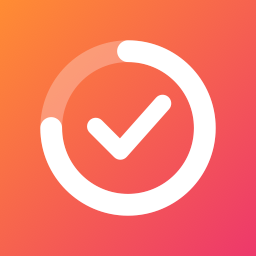

# Momentum

**Show up for what matters, every day.**
Goals, focus sessions, streaks, a daily journal and reading, on your Mac and your iPhone, with
widgets, a Live Activity and Liquid Glass throughout.

[](https://github.com/Leeevai/momentum/actions/workflows/ci.yml)


[](LICENSE)

<picture>
  <source media="(prefers-color-scheme: dark)" srcset="docs/images/today-dark.png">
  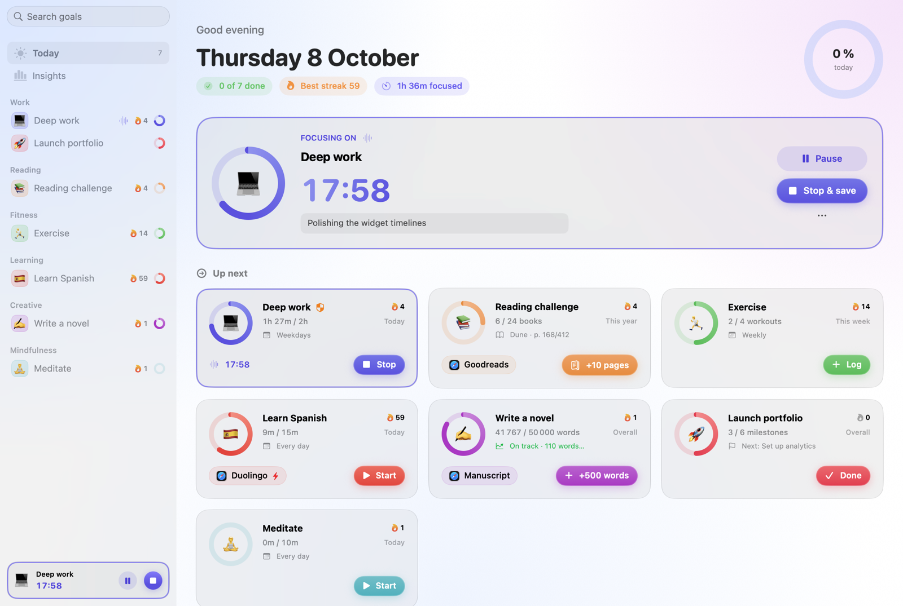
</picture>

</div>

Momentum is a native app for the hardest part of any goal: doing a little of it every day. Pick
what you want to show up for, and Momentum keeps it in front of you, in a window, in the menu bar,
on your desktop, your Home Screen and your Lock Screen, so starting is always one tap away. A coach
watches your history and tells you what's worth doing next.

<p align="center">
  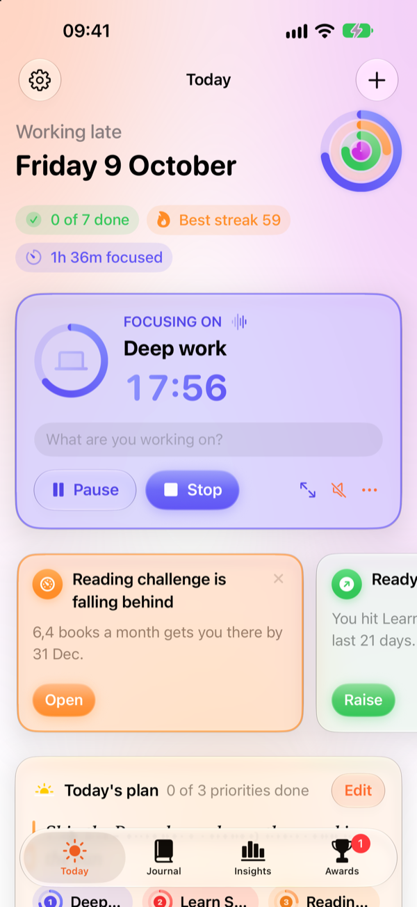
  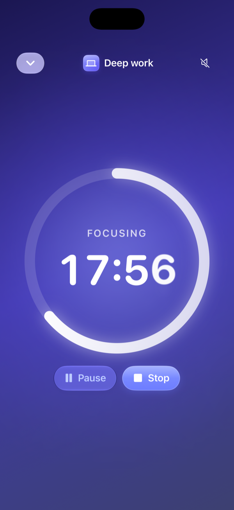
  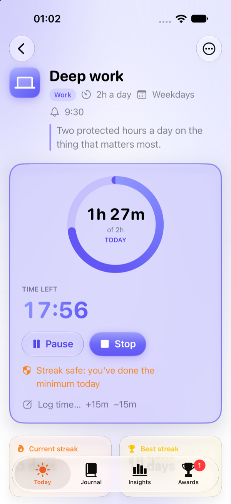
  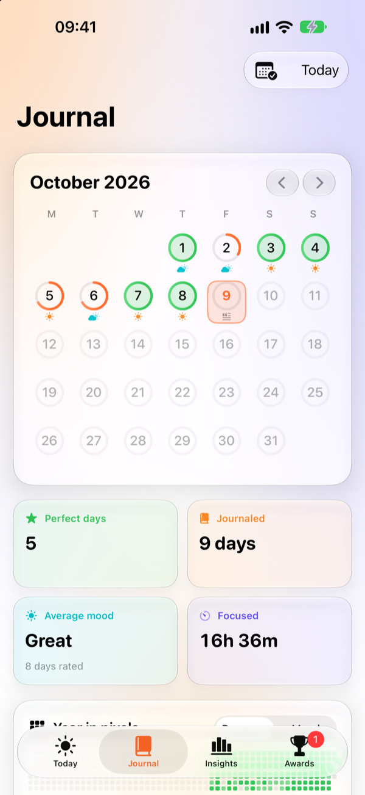
  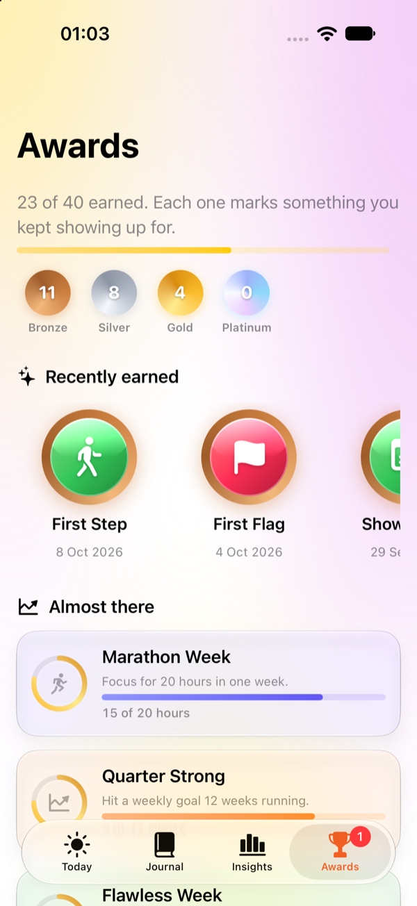
</p>

## Features

### Five kinds of goals

| Kind | Tracks | Example |
|------|--------|---------|
| **Time** | Focused minutes, with a timer or logged by hand | 2 hours of deep work on weekdays |
| **Count** | Things you do a number of times | 4 workouts a week |
| **Amount** | Any number with a unit | 20 pages a day, 100 km a month, $500 saved |
| **Books** | A reading list: pages read and books finished | 24 books this year |
| **Milestones** | A project broken into steps | Launch my portfolio in 6 steps |

Every goal can be **daily** (on the weekdays you choose), **weekly**, **monthly**, **yearly**, or an
**overall** target with a deadline, and Momentum projects whether you're on pace. Each gets an
SF Symbol icon from a searchable catalog and a color.

### A coach, not just a tracker
Today opens with a few timely tips, built from your own history:
- **Streak at risk**: in the evening, the streak that would end at midnight, and exactly how much keeps it alive.
- **Next up**: the goal you stacked after the one you just finished.
- **Your hour**: when you usually do a goal, at that hour.
- **Ready for more?** After three weeks of easy wins, a bigger target, one tap to apply. After weeks
  of misses, a smaller one that keeps the habit alive.
- Deadlines falling behind, goals left idle, books nearly finished, milestones due, and prompts to
  plan your morning and reflect in the evening.

### Habit stacking
Stack a goal after another (*after coffee, read*). Today lists it right after its anchor, finishing
the anchor celebrates with a **Next up** button, and the coach suggests it.

### Focus that gets you started
- **One-tap focus sessions** with pause and resume and a note for what you're working on.
- **Focus mode**: the session full screen, a big ring and clock over a glow that breathes about
  six times a minute, and nothing else in sight.
- **Pomodoro cycles**: a block that reaches its length is saved and a short break begins, with a
  long break after every few blocks; the next block can start by itself.
- **On the Lock Screen and in the Dynamic Island**: a Live Activity counts down the block or the
  break, with pause, stop and next-block buttons.
- **Links on every goal**: docs, repos, courses, `notion://` or `obsidian://` links, local files.
  Mark one to **open when a session starts**, so your workspace is ready.
- **How did it go?** One tap after a session (scattered, steady, in the flow), and Insights
  learns the hour your sessions go best.
- **Focus sounds**: white, pink or brown noise, generated on the fly.
- A **live timer in the menu bar**, and a **quick panel from any app** (Control-Option-M): type a
  goal and press Return to start or log it without leaving your work.

### A daily journal
Plan the morning with an intention and up to three priorities; Today shows them, ticking each one
off as its goal is done. Reflect in the evening: mood as weather, energy as a battery, a win, a few
lines. The **Journal** is a month calendar with every day ringed by how much got done, a **year
in pixels**, **on this day** (what you wrote a week, a month and a year ago), and a **week in
review** with your wins; **Insights** shows how your mood lines up
with your progress.

### Challenges
Commit a goal to a run of days: 7, 21, 30, 66, 100. Its page shows a dot for every day, filled when
kept, crossed when missed, dashed for a day off, with today's breathing until it's done; Today
shows which day you're on. Finish without a miss for an award.

### Awards
Forty-three achievements in bronze, silver, gold and platinum, from *First Step* to *Year of
Momentum*: streaks, challenges, focus hours, a 90-minute deep dive, a flawless week, a comeback
after a week away, books, milestones, journaling. Locked ones show how close you are. Each medal
morphs open into its story.

### Streaks that are fair
- Unscheduled days never break a streak, and **breaks** (a trip, a sick week) protect it entirely.
- **Hard days count**: a minimum (say 20 minutes of a 2-hour goal) keeps the streak alive.
- Weekly and monthly goals keep week and month streaks.
- **Smart reminders**, skipped on days the goal is already done, an evening **streak nudge**, and a
  **weekly recap**.

### Reading, properly
A books goal is a small library: reading, up next, finished and set aside. Find books in the Open
Library catalog with covers and page counts, import your Goodreads library, log pages with one tap
and finish books with a rating.

### Insights
Focus per day by goal against the period before, your strongest weekday, the hour you focus best,
where time went by category, mood against progress, hit rates and streaks, from 7 days to a year.

### Sync between your devices
Pick the same folder in iCloud Drive (or Dropbox, or any shared folder) on your Mac and your
iPhone. Each device keeps its own file there and merges the others' record by record: the latest
change to each goal wins, deletions stick, and progress logged anywhere adds up. No account, no
server, and nothing to resolve by hand.

### On your wrist
An Apple Watch app shows today's goals with their rings, starts, pauses and stops the timer, and
logs a check-in with one tap (or a double tap of your fingers). Complications put today's count,
the next goal or the running timer on your watch face. The iPhone does the work and
keeps the watch up to date; taps made out of its reach are delivered when it's back.

### Widgets everywhere
Interactive widgets on the Mac desktop and the iPhone Home Screen: **start and stop timers, check
in and log pages without opening the app**, follow a **challenge** day by day, see a **week of focus** by goal, and
rate today's **mood and energy** in one tap. On iPhone, Lock Screen widgets show today's progress,
and Control Center gets a focus toggle on iOS 18 and macOS 26.

<picture>
  <source media="(prefers-color-scheme: dark)" srcset="docs/images/widgets-dark.png">
  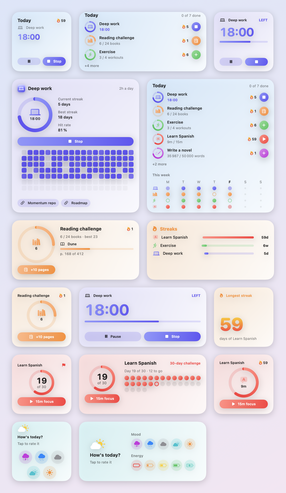
</picture>

### Twelve palettes
Pick a palette in Settings (Dusk, Ocean, Rose, Sage, Amber, Graphite, Lavender, Mint, Cherry,
Lagoon, Sand or Midnight) and it sets the accent, the **aurora drifting behind every screen**
and the widgets, on every device you sync. Goal rings **lap past 100%**, so a big day shows.

### And the rest
- **Shortcuts and Siri**: start focusing, log progress, ask how you're doing.
- **Home Screen quick actions** and **goals in Spotlight** on iPhone, and haptics that match
  what you just did.
- **Focus filters**: pair a system Focus with goal categories, so a Work Focus shows only work goals.
- **Editable history**, **share cards**, **templates**, **categories**, **archive**, full **undo**.
- **Export** a JSON backup or a CSV of every entry; a daily copy of your data is kept for 14 days.
- **Fast with years of history**: on five years of heavy use, rebuilding progress after a change
  takes about 5 ms and every streak about 4 ms.
- **Private by design**: no account, no analytics, no tracking. The only network request is the
  book search you type, sent to [Open Library](https://openlibrary.org). See the
  [privacy policy](docs/PRIVACY.md).

## Screenshots

<table>
  <tr>
    <td>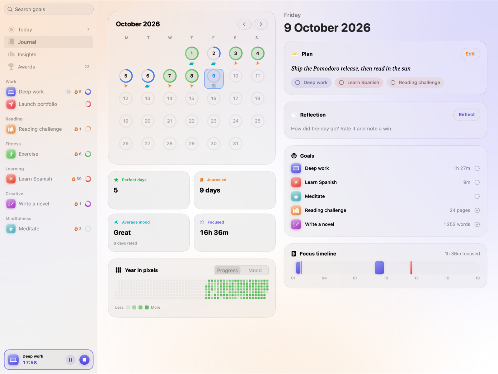</td>
    <td>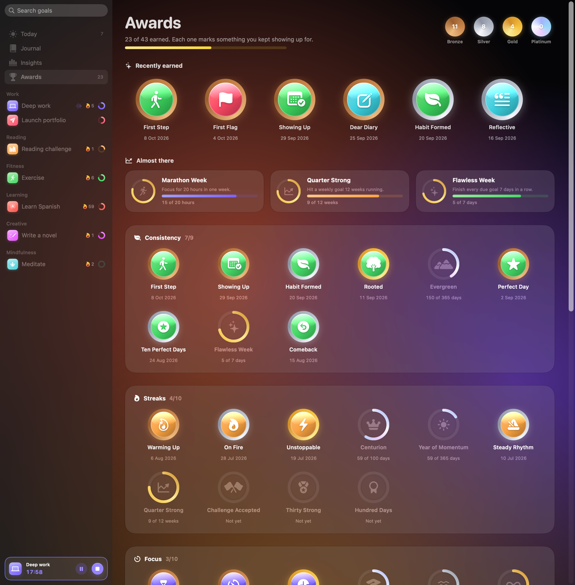</td>
  </tr>
  <tr>
    <td>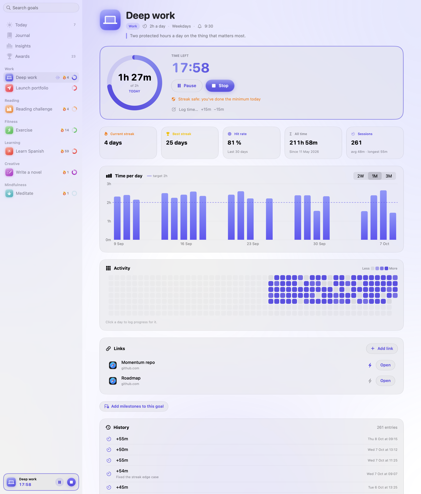</td>
    <td>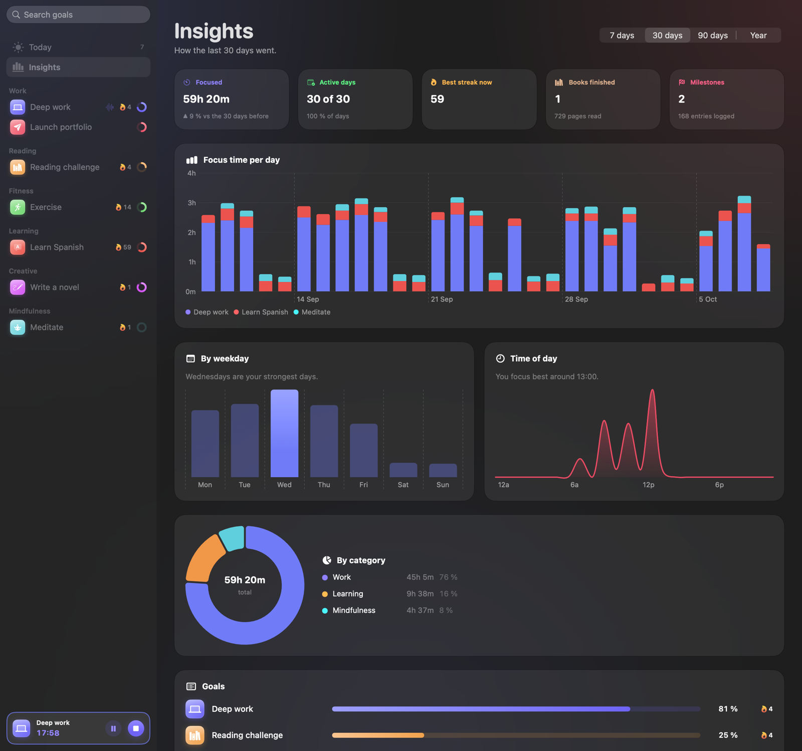</td>
  </tr>
  <tr>
    <td>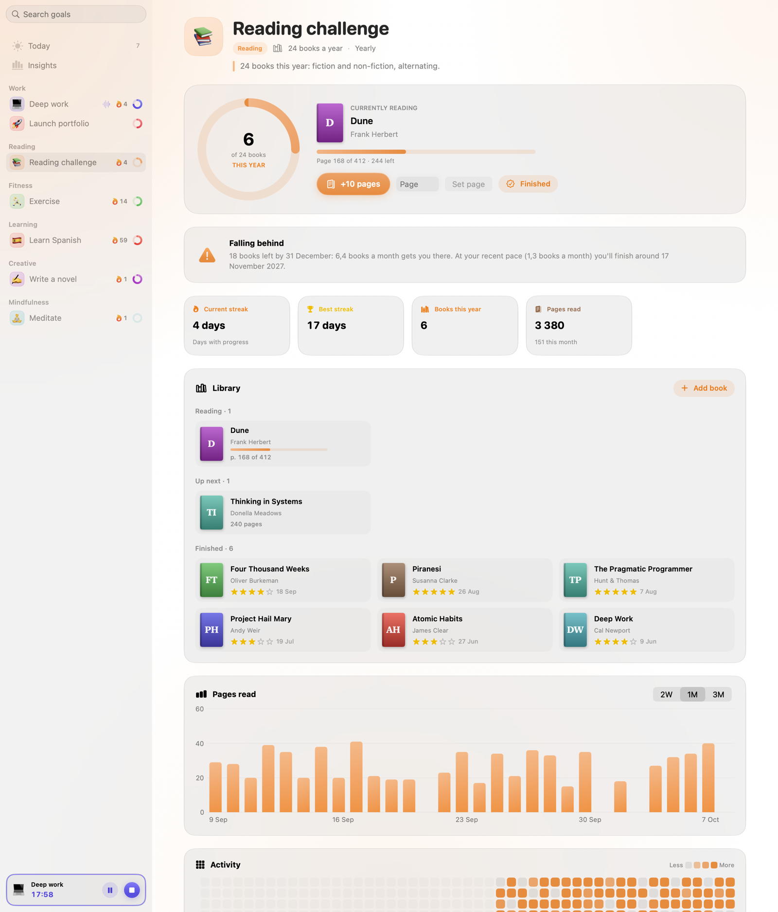</td>
    <td>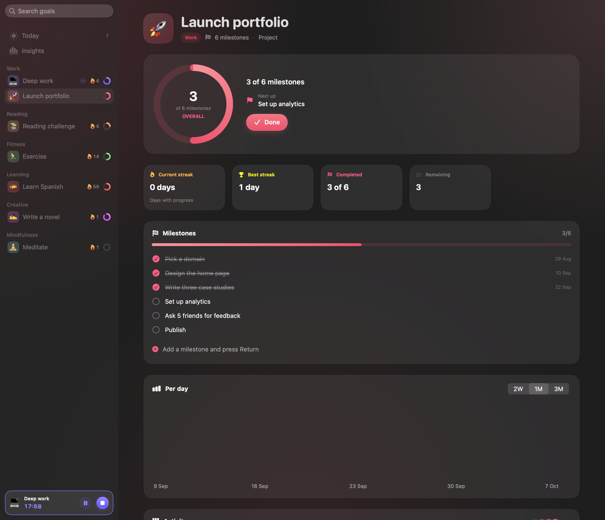</td>
  </tr>
</table>

## Keyboard shortcuts (Mac)

| Shortcut | Action |
|----------|--------|
| Control-Option-M | Quick panel from any app (change it in Settings) |
| ⌘K | Quick actions: find a goal, then start, log or open it |
| ⌘N | New goal |
| ⌘1 to ⌘4 | Today, Journal, Insights, Awards |
| ⌘5 to ⌘9 | Jump to a goal |
| ⌥⌘P / ⌥⌘R | Plan today / Reflect on today |
| ⌘E | Edit the selected goal |
| ⇧⌘P | Pause or resume the session, or start the next Pomodoro block |
| ⇧⌘S | Stop and save the session |
| ⌘Z | Undo |

## Install

Momentum builds from source with Xcode. App Store releases are being prepared
([checklist](docs/APP_STORE.md)).

**Requirements:** macOS 14, iOS 17 or watchOS 10 or later; Xcode 16 or later (Xcode 26 for
Liquid Glass).

### Mac

```bash
git clone https://github.com/Leeevai/momentum.git
cd momentum
cp Config/Local.xcconfig.example Config/Local.xcconfig   # then set your team ID
./scripts/install.sh
```

`install.sh` builds a Release copy, installs it to `/Applications` and launches it. Then
right-click the desktop → **Edit Widgets…** → search for **Momentum**.

If the desktop widgets show only grey placeholder bars, macOS has another copy of the app on
record (every Xcode build registers one) with a different version, and it refuses to draw the
installed widgets. Run `./scripts/install.sh` again: it keeps the installed copy as the only one
on record, and opening the app redraws the widgets.

### iPhone and iPad

Open `Momentum.xcodeproj`, choose the **MomentumMobile** scheme and your device, and run. To run
on a device, register the app group `group.<your bundle prefix>.momentum` for your team (Xcode
offers to under Signing & Capabilities); the simulator needs nothing.

### Apple Watch

The watch app is embedded in the iPhone app, so installing Momentum on an iPhone paired with a
watch offers it in the Watch app. To run it from Xcode, choose the **MomentumWatch** scheme and
your watch (or a watch simulator, after `xcodebuild -downloadPlatform watchOS`).

> **Why a team ID?** The apps and their widgets are separate processes that share data through an
> app group, which the system grants only to signed code. Any Apple ID works, including a free one.

## Development

```bash
swift test --package-path Packages/MomentumKit   # the core's test suite
open Momentum.xcodeproj                          # run the apps from Xcode
./scripts/screenshots/render.sh                  # regenerate the Mac screenshots from demo data
./scripts/app-store-screenshots.sh               # App Store screenshots: iPhone, iPad, Watch, Mac
./scripts/archive.sh                             # archive both apps for App Store Connect
```

Shipping to the App Store is described in [docs/APP_STORE.md](docs/APP_STORE.md).

| Path | What lives there |
|------|------------------|
| `Packages/MomentumKit` | **MomentumCore**: the model, the progress engine (periods, streaks, pace, insights, achievements, coach), Pomodoro, the journal, sync (stamps, merge, folder layout), persistence and migrations, reminder planning. Swift 6, no UI, fully tested. |
| `SharedUI/` | The store, side effects and every screen both apps share: Today's cards, goal pages, editors, Journal, Insights, Awards, the design system. |
| `Momentum/` | The Mac app: window and sidebar, menu bar, quick panel and global shortcut, Settings. |
| `MomentumMobile/` | The iPhone and iPad app: tabs, Today with zoom transitions, Settings, and the link to the watch. |
| `MomentumWatch/` | The Apple Watch app: today's goals, a page per goal, the timer. It shows a snapshot the iPhone sends. |
| `MomentumWidgets/` | The widgets, for both platforms, and the iPhone Live Activity. |
| `Shared/` | Code the apps and widgets all compile: storage location, App Intents, the Live Activity model. |
| `Config/` | Signing (`Shared.xcconfig`), entitlements and Info.plists. |

See [docs/ARCHITECTURE.md](docs/ARCHITECTURE.md) for how data flows between the apps, the
widgets and other devices. Every change goes through a pull request into `develop`;
[CONTRIBUTING.md](.github/CONTRIBUTING.md) covers branches, the commit format and releases.

## Roadmap

- [x] Control Center focus toggle
- [x] Book search with covers, and Goodreads import
- [x] Focus filters
- [x] Sync between devices
- [x] An iPhone and iPad app, with Lock Screen widgets and a Live Activity
- [x] Pomodoro cycles, a daily journal, awards and a coach
- [x] Apple Watch, with complications
- [x] Challenges and session ratings
- [ ] App Store releases
- [ ] Translations
- [ ] Sync through iCloud without picking a folder

## License

[MIT](LICENSE) © 2026 Leeevai

The look follows [glasscn](https://glasscn.app) (MIT, © 2026 Tim Mikeladze): its palettes, its
glass and its aurora, ported to SwiftUI.
