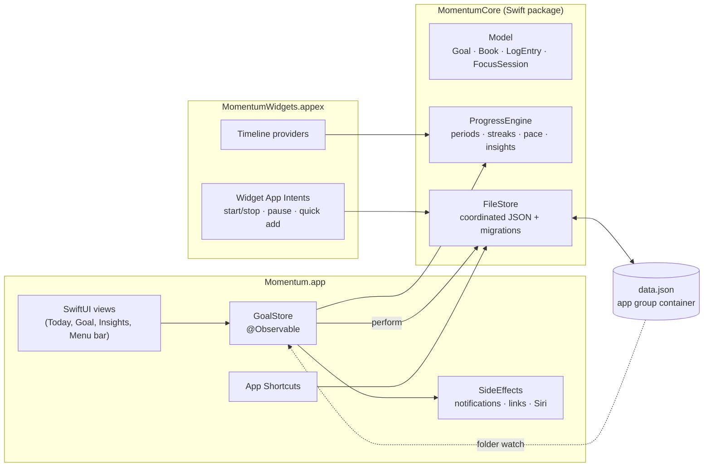

# Architecture

On each device Momentum is two processes that share one data file: the app, and its WidgetKit
extension. Devices share data through a sync folder. Everything that decides *what progress means*
lives in a UI-free Swift package, so it can be tested in isolation and reused everywhere; the store
and most screens are shared between the Mac and iPhone apps.

## The data file

`AppData` (goals, log entries, the running session, preferences) is stored as one JSON file in the
app group container, `~/Library/Group Containers/<team>.<prefix>.momentum/Momentum/data.json`.

- **Every write is a coordinated read-modify-write.** `FileStore.update` reads the latest file
  inside an `NSFileCoordinator` write, applies the change, and writes atomically. A widget button
  and the app can never overwrite each other's change.
- **Decoding is tolerant.** Every field decodes with a default when missing, so adding a field
  never makes an existing file unreadable, and a file a newer version saved in the same format
  still opens.
- **Newer formats are refused.** A file whose `version` is above `AppData.currentVersion` would
  read without what's new and lose it at the next save, so it's treated as unreadable instead,
  and a sync file in a newer format isn't merged. Settings asks for an update.
- **Old formats migrate.** A file without a `version` is the 0.1 format; it converts on read, and
  the first read keeps an untouched copy as `data.v1-backup.json`.
- **Nothing is ever silently lost.** An unreadable file is copied aside before Momentum starts
  fresh, and an import keeps the previous file as a backup.

## Progress is derived, not stored

The file stores facts: log entries (with a date, an amount in base units, an optional note and
book), milestone and book completion dates, and breaks. Everything shown is computed from those
facts by `ProgressEngine`:

- **Periods.** A goal's target applies per day, week, month, year, or overall. The engine finds the
  calendar period containing a date and sums the entries in it.
- **Live sessions.** A running `FocusSession` is a list of segments (pausing closes one). Its time
  counts toward every period it overlaps, live, so rings move while the timer runs. Stopping writes
  one entry per calendar day the session touched.
- **Streaks.** Consecutive periods with the target met. Today never breaks a streak while it is
  still open, unscheduled days are skipped, and days inside a break are protected. Books and
  milestones count consecutive days with any activity.
- **Pace.** For yearly, monthly and overall goals, the engine compares the recent rate (14 days,
  or 90 days of finished books) with what the deadline needs, and projects a finish date.

The engine indexes entries by goal and day when it is built, so the many per-render queries are
dictionary lookups. The app rebuilds it only when data changes; live counters redraw themselves
with `TimelineView`, so a running timer never re-renders the whole window.

## The app

`GoalStore` is the single source of truth. Every change goes through
`perform(_ undoName:_:)`, which writes the file, rebuilds the engine, registers undo, celebrates
goals that just reached their target, and hands the change to `SideEffects`:

- **Notifications.** Reminders can't check a condition when they fire, so the app schedules one-off
  reminders for the next week and replans whenever data changes. That's how a reminder skips a day
  that's already done. A planned session gets a time's-up notification, kept in step with
  pause/resume.
- **Links.** When a session starts (in the app, from a widget, or from Siri), links marked
  *opens with focus* open. Local files use security-scoped bookmarks so the sandboxed app can reopen
  them.
- **Siri.** App Shortcut parameters are refreshed when goal names change.

Changes made by the widgets are picked up by watching the data folder; saves are atomic renames,
which register as writes to the folder.

## The widgets

Timelines are computed from the same engine. Counters use `Text`'s timer styles so they tick
without new entries; rings only move when an entry renders, so a running session gets an entry
every five minutes and one at its planned end, and otherwise the next entry is midnight. Buttons run
App Intents (`Shared/Intents`) inside the widget process, which update the file and reload all
timelines. Links in widgets use `momentum://` deep links that the app resolves. The timeline sets
the active palette, built-in or custom, from the file it loads, and a button's label is white or
black, whichever reads on its goal's color (`WidgetFilledLabel`).

## The look

The design follows [glasscn](https://glasscn.app): frosted panes with a lit rim over a drifting
aurora, in one of its palettes.

- **Palettes** live in the core because the choice is a synced preference that the widgets read
  from the data file. Every palette comes from a `PaletteRecipe`: an accent, a background tint,
  goal colors in a harmony around a base hue (spectrum, analogous, complementary, triadic or
  monochrome), and a lightness and contrast. `PaletteGenerator` turns it into light and dark
  `PaletteTokens` in OKLCH, as glasscn defines its themes: the accent, the aurora, chart colors and
  one swatch per `GoalColor`, so a goal's stored color picks the palette's matching swatch. Colors
  are kept inside sRGB by lowering their chroma, and white or black text reaches 4.5:1 on every
  swatch and accent. The built-in palettes (`ThemePalette`) are curated recipes, and a retired
  one's name decodes as the closest that remains; custom ones are saved in
  `Preferences.customPalettes`. `Preferences.activePalette` is the one in use. While a custom
  palette is in use, `Preferences.palette` holds the closest built-in one, which versions without
  custom palettes draw in. `Color(_: OKLCH)` in `Shared/GlassTheme.swift` converts the colors.
- **Where the palette comes from.** The store works out the active palette (`GoalStore.palette`)
  when the palette preferences change and sets `ActivePalette.current`; the widget timeline sets it
  when it loads the file. Each window's root applies `.storePalette()`, which sets the `palette`
  environment value and the tint. Components that draw goal colors (rings, bars, icons, glyphs,
  challenge badges, highlighted glass) read the palette from the environment, so they redraw when
  it changes and the palette editor's preview can draw another one. Elsewhere `goal.tint`,
  `GoalColor.color`, `Color.accent` and the named roles (`.streak`, `.success`, `.attention`,
  `.focus`, `.award`, `.rest`, `.swatch(_:)`) use the active palette's colors, made once per
  palette (`PaletteColors`). Each is a dynamic color named after its palette, so a view redrawn in
  a new palette gets a new color. Errors and warnings keep the system's red and orange.
- **Labels on fills.** A prominent button's label is white or black, whichever contrasts more with
  its fill (`Color.foreground(in:)`), so in dark mode, where swatches are light, labels are black.
  Icon tiles, medals and kept days keep white symbols on a deep shade of their color
  (`GoalColor.tile`), which holds white at 4.5:1.
- **Glass.** `GlassTokens` holds glasscn's numbers (pane fills, rim, highlight, sheen, shadow,
  radii, press squash and easing) for light and dark. `GlassCard` uses Liquid Glass tinted with
  them on macOS 26 and iOS 26, and a frosted material with the fill, sheen, rim and shadow before.
- **The aurora** (`Shared/Aurora.swift`) is three radial-gradient blobs moved by transforms, so the
  drift is cheap; it stands still with Reduce Motion, in Low Power Mode, in widgets and in swatches.
- **Widgets drawn in one tint** (the faded desktop, tinted Home Screens) collapse each element to a
  single silhouette, so anything white on a fill (buttons, goal tiles) switches to a wash under its
  label there (`WidgetFilledLabel`), and photos are marked to stay photos.

## One codebase, two apps

| Folder | Built into |
|--------|------------|
| `Packages/MomentumKit` | everything |
| `Shared/` | both apps and both widget extensions |
| `SharedUI/` | both apps: the store, side effects, sync, and every screen that suits both |
| `Momentum/` | the Mac app: window, sidebar, menu bar, quick panel, Settings |
| `MomentumMobile/` | the iPhone and iPad app: tabs, Today, Settings, the watch link |
| `MomentumWatch/` | the Apple Watch app, showing what the iPhone sends |
| `MomentumWidgets/` | both widget extensions; the Live Activity is iOS only |

Platform differences are switched inline with `#if os(...)` (file panels become file importers,
sounds become haptics) and layouts adapt with `ViewThatFits`: a header lays out in a row when the
row fits and stacks on a phone. Liquid Glass is behind `#available(macOS 26.0, iOS 26.0, *)`.

## Sync

Sync works through any folder every device can reach, usually in iCloud Drive. Each device writes
only its own file there, `<device id>.momentum-sync`, so no two devices ever write the same file
and no sync service has a conflict to resolve.

- **Every save is stamped.** `FileStore.transform` runs `SyncStamper`, which records in
  `AppData.sync` when each goal, entry and journal day last changed, and leaves a tombstone for
  anything deleted. Entries that were only ever added need no stamp.
- **Merging is record by record.** `SyncMerge.merge` takes the latest change to each record,
  keeps deletions unless the record changed again afterwards, unions the entries, and keeps each
  achievement's earliest date. Ties break on the records' content, so the merge is commutative,
  associative and idempotent: devices converge whatever order they sync in, and however the
  merges are grouped. A randomized three-device test checks all three.
- **The merge only picks records; it never judges them.** Anything that depends on several
  records at once would break that guarantee, so it happens elsewhere. The goal order is a list
  of its own, last arranged wins, with goals it doesn't mention after it in a fixed order.
  Entries for a goal deleted elsewhere stay in the file and count for nothing (the engine skips
  them), so they come back if the goal does.
- **Merges keep their stamps.** A merge is written with stamping off, so a change keeps the time
  it was really made and can't outrank a newer one from a third device.
- **The timer.** The running session and the break each take the latest change. What only a
  merge can produce, a timer on a deleted goal or a session alongside a break, is settled by the
  app afterwards (`settleTimer`) as a change of its own, which then syncs out. Entries a session
  logs have ids derived from the session, so two devices stopping the same session log it once.
- **When.** A device writes its file a moment after each change, and merges others' files when
  the folder changes, every minute, when the app comes forward, and before a Lock Screen or
  widget button acts.
- **Known limit.** Deletions are remembered for 180 days, and files not saved for 150 days aren't
  merged (unless this device has no data yet). A device that comes back after more than 180 days
  away can still bring back records deleted elsewhere in the meantime.

## The Apple Watch

The watch app (`MomentumWatch/`) holds no data of its own. The iPhone works out a
`WatchSnapshot` on every change (today's goals with progress, streaks and one-tap actions, the
timer and the break: a few kilobytes) and sends it as the WatchConnectivity application context.
It sends one too when the app comes forward and when the day turns, which changes what's due
without changing the data, and the store passes on changes it takes in while the app runs in the
background with no window. A tap on the watch is a `WatchCommand`: an explicit action (start a goal; stop or pause *the
session the watch showed*; log), the time it was tapped, and an id. The iPhone, woken in the
background if needed, applies it to the shared data file as a widget would, once per id, dated
when it was tapped, and replies with the new snapshot. So a reply lost on the way back can be
resent safely, a Stop that arrives late doesn't count the hours in between, and a stale Stop
can't end a newer session. Out of the iPhone's reach, commands go by `transferUserInfo`, and new
ones queue behind them so they arrive in the order tapped.

The snapshot also carries the iPhone's palette as it looks in dark mode, the watch's only
appearance (`WatchPalette`: the accent and a swatch per goal color), so a goal has the same color
on the wrist. The watch app draws in it through the `watchPalette` environment value; a snapshot
from an iPhone that doesn't send one, or a palette it can't read, draws in the default palette.
The complications are drawn in the face's tint, as accessory complications are.

The watch keeps the last snapshot, so it opens instantly; one from an earlier day shows daily
goals starting over. The complications read it from the app group: the iPhone pushes an update
(`transferCurrentComplicationUserInfo`, a few dozen a day) when something on the face changes,
and their timeline has an entry at midnight and at the end of a planned block.

## The Live Activity

On iPhone a running session or Pomodoro break shows on the Lock Screen and in the Dynamic Island.
`FocusActivityController.sync(with:)` (in `Shared/`) derives the activity from the data, so the
app calls it after every change and when it becomes active (only a foreground app may start one).
Its buttons are App Intents that conform to `LiveActivityIntent`, so they run in the app's
process, change the data and update the activity in one go. So are the widgets' timer buttons,
the Control Center focus toggle and Siri's start and stop: an app in the background may start a
Live Activity only while it performs one, and a widget extension can't start or end the app's.
The goal's color in the active palette, as it looks on a dark background, travels in the content
state rather than the attributes, so a new palette reaches a running activity; the widget
extension never has to read the data file to draw it.

## Performance

Measured on five years of heavy use (29,000 entries): building the engine takes about 5 ms
(day keys come from time zone arithmetic in `DayMath`, not `Calendar`); streak history is
memoized across engines under a fingerprint of everything it depends on; undo patches and sync
stamps diff only the stretch of entries that changed; a save doesn't decode a file whose date
hasn't moved since this process wrote it; achievements are measured off the main thread.

## Signing

Each app and its extension must share an app group. macOS grants one only to code signed by the
team in the group's prefix; iOS groups are named `group.…` and must be registered for the team
(`IOS_APP_GROUP_ID`). `Config/Shared.xcconfig` defines the team and bundle prefix and derives
`APP_GROUP_ID`; the entitlements and Info.plists read it. A contributor overrides the team in a
gitignored `Config/Local.xcconfig`. The group ID reaches the code through the `MomentumAppGroupID`
Info.plist key.
