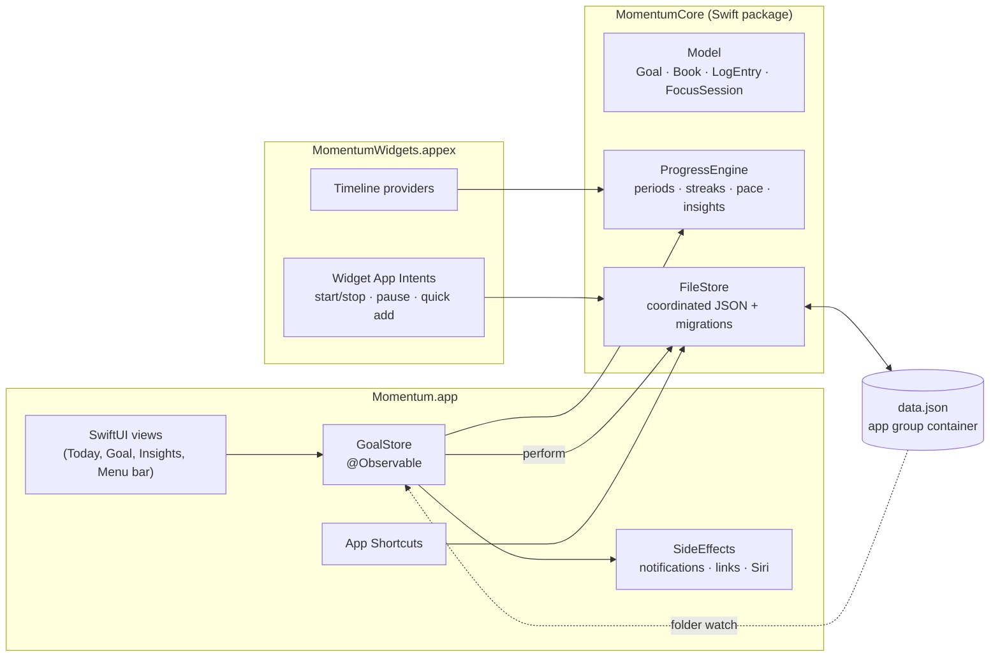

# Architecture

Momentum is two processes that share one data file: the app, and its WidgetKit extension.
Everything that decides *what progress means* lives in a UI-free Swift package, so it can be
tested in isolation and reused by both.

## The data file

`AppData` (goals, log entries, the running session, preferences) is stored as one JSON file in the
app group container, `~/Library/Group Containers/<team>.<prefix>.momentum/Momentum/data.json`.

- **Every write is a coordinated read-modify-write.** `FileStore.update` reads the latest file
  inside an `NSFileCoordinator` write, applies the change, and writes atomically. A widget button
  and the app can never overwrite each other's change.
- **Decoding is tolerant.** Every field decodes with a default when missing, so adding a field
  never makes an existing file unreadable, and a file from a newer version still opens.
- **Old formats migrate.** A file without a `version` is the 0.1 format; it converts on read, and
  the first read keeps an untouched copy as `data.v1-backup.json`.
- **Nothing is ever silently lost.** An unreadable file is copied aside before Momentum starts
  fresh, and an import keeps the previous file as a backup.

## Progress is derived, not stored

The file stores facts: log entries (with a date, an amount in base units, an optional note and
book), milestone and book completion dates, and breaks. Everything shown is computed from those
facts by `ProgressEngine`:

- **Periods.** A goal's target applies per day, week, month, year, or overall. The engine finds the
  calendar period containing a date and sums the entries in it.
- **Live sessions.** A running `FocusSession` is a list of segments (pausing closes one). Its time
  counts toward every period it overlaps, live, so rings move while the timer runs. Stopping writes
  one entry per calendar day the session touched.
- **Streaks.** Consecutive periods with the target met. Today never breaks a streak while it is
  still open, unscheduled days are skipped, and days inside a break are protected. Books and
  milestones count consecutive days with any activity.
- **Pace.** For yearly, monthly and overall goals, the engine compares the recent rate (14 days,
  or 90 days of finished books) with what the deadline needs, and projects a finish date.

The engine indexes entries by goal and day when it is built, so the many per-render queries are
dictionary lookups. The app rebuilds it only when data changes; live counters redraw themselves
with `TimelineView`, so a running timer never re-renders the whole window.

## The app

`GoalStore` is the single source of truth. Every change goes through
`perform(_ undoName:_:)`, which writes the file, rebuilds the engine, registers undo, celebrates
goals that just reached their target, and hands the change to `SideEffects`:

- **Notifications.** Reminders can't check a condition when they fire, so the app schedules one-off
  reminders for the next week and replans whenever data changes. That's how a reminder skips a day
  that's already done. A planned session gets a time's-up notification, kept in step with
  pause/resume.
- **Links.** When a session starts (in the app, from a widget, or from Siri), links marked
  *opens with focus* open. Local files use security-scoped bookmarks so the sandboxed app can reopen
  them.
- **Siri.** App Shortcut parameters are refreshed when goal names change.

Changes made by the widgets are picked up by watching the data folder; saves are atomic renames,
which register as writes to the folder.

## The widgets

Timelines are computed from the same engine. Counters use `Text`'s timer styles so they tick
without new entries; rings only move when an entry renders, so a running session gets an entry
every five minutes and one at its planned end, and otherwise the next entry is midnight. Buttons run
App Intents (`Shared/Intents`) inside the widget process, which update the file and reload all
timelines. Links in widgets use `momentum://` deep links that the app resolves.

## Signing

The app and the extension must share an app group, which macOS grants only to code signed by the
team in the group's prefix. `Config/Shared.xcconfig` defines the team and bundle prefix and derives
`APP_GROUP_ID`; the entitlements and Info.plists read it. A contributor overrides the team in a
gitignored `Config/Local.xcconfig`. The group ID reaches the code through the `MomentumAppGroupID`
Info.plist key.
